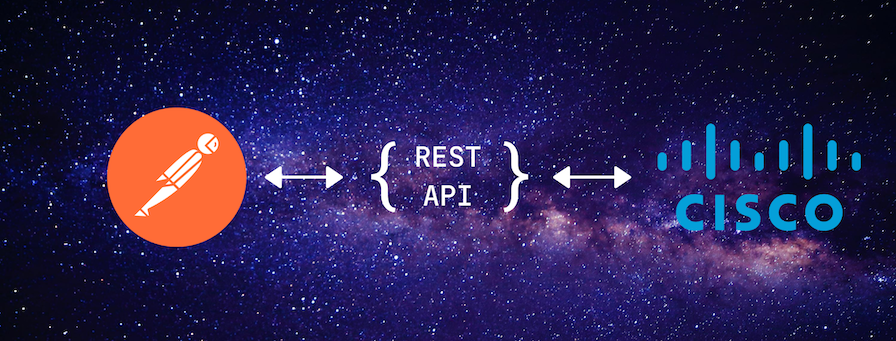
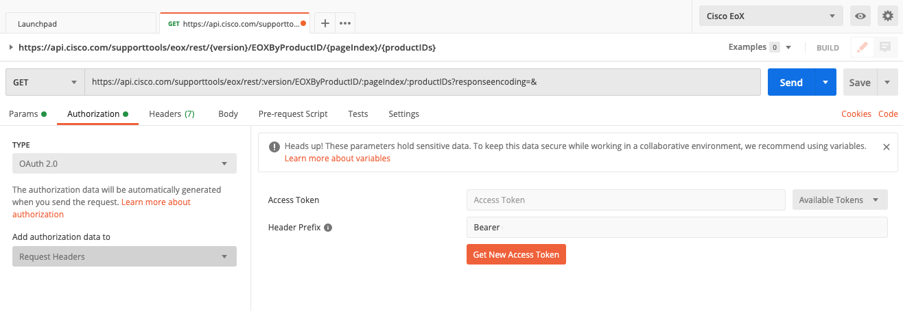
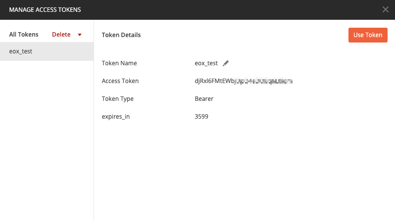
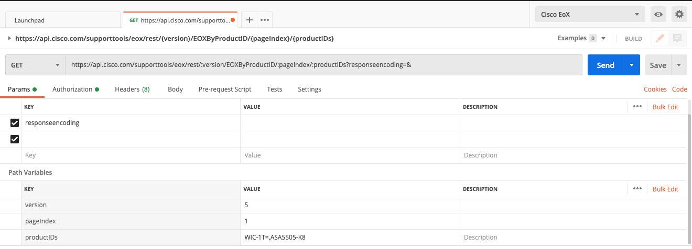
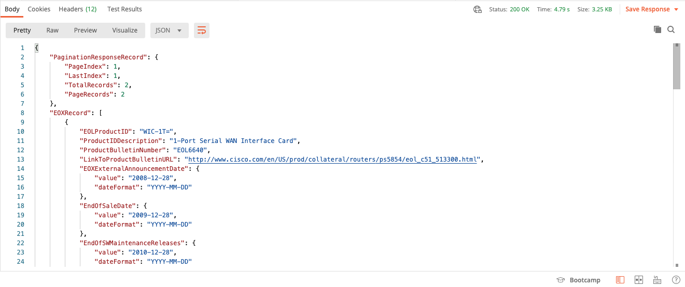

# Using Cisco Support API with Postman

<figure markdown>
  
</figure>

In this post, I would like to make a quick introduction on how to make use of [Cisco Support APIs](https://developer.cisco.com/site/support-apis/).
Cisco has several [Data APIs](https://developer.cisco.com/docs/) which allow their partners and customers to consume a lot of different information about their products and services programmatically.
Here is the list of all available Data APIs:

* [Support APIs](https://developer.cisco.com/site/support-apis/)
* [Services APIs](https://developer.cisco.com/docs/service-apis/)
* [Product Security Incident Reponse Team](https://developer.cisco.com/psirt/)
* [Business Critical Insights](https://developer.cisco.com/docs/business-critical-service-apis/)

<!-- more -->

This post takes Cisco Support API as an example. Actually, Cisco Support API is an umbrella term which includes the following APIs:

* [Automated Software Distribution](https://developer.cisco.com/docs/support-apis/#automated-software-distribution)
* [Bug](https://developer.cisco.com/docs/support-apis/#bug)
* [Case](https://developer.cisco.com/docs/support-apis/#case)
* [EoX](https://developer.cisco.com/docs/support-apis/#eox)
* [Product Information](https://developer.cisco.com/docs/support-apis/#product-information)
* [Serial Number to Information](https://developer.cisco.com/docs/support-apis/#serial-number-to-information)
* [Service Order Return (RMA)](https://developer.cisco.com/docs/support-apis/#service-order-return-rma)
* [Software Suggestion](https://developer.cisco.com/docs/support-apis/#software-suggestion)

As you can see its quite a lot. Here is a few examples of what can be done with it:

* Find a recommended software image for a device and download it
* Find out what devices in your network had EoL announced
* List all known bugs for a device
* etc. etc.

As for me, I find *EoX* and *Software Suggestion* as most useful in my daily work, because I do customer network audits often.

## Prerequisites

This is the bad part. You need a valid contract with Cisco, either [SNTC](https://www.cisco.com/c/en/us/support/services/smart-net-total-care/index.html) or PSS (Partner Support Service) to get access to Support APIs.
Without a contract, you can only get access to a couple of APIs, and the only useful one is the [PSIRT openVuln API](https://developer.cisco.com/docs/psirt/).

This is actually pretty lame because information such as EoX announcements and recommended software is publicly available. Why Cisco demands having a contract to access those APIs is beyound my comprehension.

## Onboarding

Assuming you have the contract number you need to perform the following tasks to acquire access to APIs.

### SNTC

Your Cisco account must have an API developer role. To check this:

1. Login to [cisco.com](https://cisco.com)
1. Go to *Manage Profile*
1. Find *Smart Services* section
1. Check if *API Developer role* is active

If not, either:

5. Find out who in your company is a company administrator by clicking on *Contact Company Administrator*
6. Ask them to assign that role to your account

Or

5. Become your company administrator by following [this guide](https://www.cisco.com/c/en/us/support/docs/services/sntc/onboarding_guide.html)
6. Assign *API developer* role to your account

### PSS

This is the path I took as our company has Cisco partner status.
The detailed guide can be found [here](https://community.cisco.com/t5/pss-documentation-library/request-access-to-the-pss-apis/ta-p/4094595), but there is a catch.
When I followed this guide to open a support case I ran into an issue.
I couldn't bypass the entitlement check when opening a case as its described in the guide, so I had to click the "Chat Now" button and ask for support (to open a support case :joy:).
Fortunately, they responded quickly and created a case on my behalf.
All I needed to provide was our company PSS contract number and a list of APIs I needed access to.
After that, it took about 2 days for the actual support case to complete.

## Cisco API Console

At last, after finishing all the administrative quests we can proceed to the technical part.
To use any of the APIs you first need to register your application. This is done in the [Cisco API Console](https://apiconsole.cisco.com/).
Below are the detailed steps:

1. Log in with you cisco.com credentials
2. Go to [My Apps & Keys](https://apiconsole.cisco.com/apps/myapps)
3. Click [Register a New App](https://apiconsole.cisco.com/apps/register)
4. Enter the *Name of your application*. This can be anything and is needed only to distinguish between different applications
5. In the *OAuth2.0 Credentials* section check only the *Client Credentials* checkbox

6. Select one or more APIs you plan to use with this application (this can be changed later)
7. Check *I agree to the terms of service* and click *Register*
8. You will be redirected to a page saying that your application has been registered
9. Now click on [My Apps & Keys](https://apiconsole.cisco.com/apps/myapps) and you will see something like this:
    <figure markdown>
      
      <figcaption>Cisco API Console - Apps & Keys</figcaption>
    </figure>
10. Make note of the *KEY* and *CLIENT SECRET* values

## Postman setup

[Postman](https://www.postman.com/downloads/) is a great tool to test and develop APIs. It has a simple GUI and is available on Windows, Linux, and macOS.
It's also [extensively](https://developer.cisco.com/search/postman/) featured in various DevNet docs.
Installation is pretty straightforward and I don't want to linger on it here.

To simplify Support API consumption in Postman you can download WADL files from [Cisco](https://developer.cisco.com/docs/support-apis/#!download-cisco-support-apis/cisco-support-api-downloads) and then import them as collections. Collections in Postman are just pre-configured API requests.

## EoX Example

Now let's try and make an API call to EoX API as an example.
If you have imported a WADL file in the previous steps then your Postman window should look like this:

<figure markdown>
  
  <figcaption>Postman - Collections</figcaption>
</figure>

I use Get [EoX by Product ID(s)](https://developer.cisco.com/docs/support-apis/#!eox/get-eox-by-product-ids) method in this example.

To make an API call we first need to get an auth token.
To do this switch to the *Authorization* tab and select *OAuth 2.0* type and *Request Headers* in the *"Add authorization data to"* field.

<figure markdown>
  
  <figcaption>Postman - Authorization</figcaption>
</figure>

Now click on *Get New Access Token* button and fill the following fields accordingly:

<figure markdown>
  
  <figcaption>Postman - New Access Token</figcaption>
</figure>

* Token Name - just any name for the token, `eox_test` for example
* Grant Type - Client Credentials (remember we selected it during the app registration)
* Access Token URL - `https://cloudsso.cisco.com/as/token.oauth2` (I learned this URL from [here](https://apiconsole.cisco.com/files/Token_Access.pdf))
* Client ID - your application *KEY*
* Client Secret - your application *CLIENT SECRET*
* Client Authentication - Send as Basic Auth header

Click *Request Token* and you should see the following result:

<figure markdown>
  
  <figcaption>Postman - Manage Access Tokens</figcaption>
</figure>

Click *Use Token* and that's it for the authorization.

Now we need to specify request parameters. Take a look at the *Path Variables* section of the request.
Here you need to specify `version` which is `5` and `productIDs` which can be a single PID or a list separated by commas (250 symbols max).

<figure markdown>
  
  <figcaption>Postman - Request Params</figcaption>
</figure>

You can also specify the `responseencoding` which can be either JSON (default) or XML.

When all is set click *Send* button and you should get the response in the lower half of the Postman window.

<figure markdown>
  
  <figcaption>Postman - Response body</figcaption>
</figure>

??? example "Click here to see the whole response I've got in this example"

    ```json
    {
        "PaginationResponseRecord": {
            "PageIndex": 1,
            "LastIndex": 1,
            "TotalRecords": 2,
            "PageRecords": 2
        },
        "EOXRecord": [
            {
                "EOLProductID": "WIC-1T=",
                "ProductIDDescription": "1-Port Serial WAN Interface Card",
                "ProductBulletinNumber": "EOL6640",
                "LinkToProductBulletinURL": "http://www.cisco.com/en/US/prod/      collateral/routers/ps5854/eol_c51_513300.html",
                "EOXExternalAnnouncementDate": {
                    "value": "2008-12-28",
                    "dateFormat": "YYYY-MM-DD"
                },
                "EndOfSaleDate": {
                    "value": "2009-12-28",
                    "dateFormat": "YYYY-MM-DD"
                },
                "EndOfSWMaintenanceReleases": {
                    "value": "2010-12-28",
                    "dateFormat": "YYYY-MM-DD"
                },
                "EndOfSecurityVulSupportDate": {
                    "value": "",
                    "dateFormat": "YYYY-MM-DD"
                },
                "EndOfRoutineFailureAnalysisDate": {
                    "value": "2010-12-28",
                    "dateFormat": "YYYY-MM-DD"
                },
                "EndOfServiceContractRenewal": {
                    "value": "2014-03-28",
                    "dateFormat": "YYYY-MM-DD"
                },
                "LastDateOfSupport": {
                    "value": "2014-12-31",
                    "dateFormat": "YYYY-MM-DD"
                },
                "EndOfSvcAttachDate": {
                    "value": "2010-12-28",
                    "dateFormat": "YYYY-MM-DD"
                },
                "UpdatedTimeStamp": {
                    "value": "2012-12-06",
                    "dateFormat": "YYYY-MM-DD"
                },
                "EOXMigrationDetails": {
                    "PIDActiveFlag": "Y",
                    "MigrationInformation": "1-Port Serial WAN Interface Card",
                    "MigrationOption": "Enter PID(s)",
                    "MigrationProductId": "HWIC-1T=",
                    "MigrationProductName": "",
                    "MigrationStrategy": "",
                    "MigrationProductInfoURL": "http://www.cisco.com/en/US/prod/       collateral/modules/ps5949/datasheet_c78-491363.html"
                },
                "EOXInputType": "ShowEOXByPids",
                "EOXInputValue": "WIC-1T= "
            },
            {
                "EOLProductID": "ASA5505-K8",
                "ProductIDDescription": "ASA 5505 Appliance with SW, 10 Users, 8       ports, DES",
                "ProductBulletinNumber": "EOL11376",
                "LinkToProductBulletinURL": "https://www.cisco.com/c/en/us/products/       collateral/security/asa-5505-adaptive-security-appliance/      eos-eol-notice-c51-738642.html",
                "EOXExternalAnnouncementDate": {
                    "value": "2017-02-24",
                    "dateFormat": "YYYY-MM-DD"
                },
                "EndOfSaleDate": {
                    "value": "2017-08-25",
                    "dateFormat": "YYYY-MM-DD"
                },
                "EndOfSWMaintenanceReleases": {
                    "value": "2018-08-25",
                    "dateFormat": "YYYY-MM-DD"
                },
                "EndOfSecurityVulSupportDate": {
                    "value": "2020-08-24",
                    "dateFormat": "YYYY-MM-DD"
                },
                "EndOfRoutineFailureAnalysisDate": {
                    "value": "2018-08-25",
                    "dateFormat": "YYYY-MM-DD"
                },
                "EndOfServiceContractRenewal": {
                    "value": "2021-11-20",
                    "dateFormat": "YYYY-MM-DD"
                },
                "LastDateOfSupport": {
                    "value": "2022-08-31",
                    "dateFormat": "YYYY-MM-DD"
                },
                "EndOfSvcAttachDate": {
                    "value": "2018-08-25",
                    "dateFormat": "YYYY-MM-DD"
                },
                "UpdatedTimeStamp": {
                    "value": "2017-09-27",
                    "dateFormat": "YYYY-MM-DD"
                },
                "EOXMigrationDetails": {
                    "PIDActiveFlag": "Y",
                    "MigrationInformation": "",
                    "MigrationOption": "Enter Product Name(s)",
                    "MigrationProductId": "",
                    "MigrationProductName": "ASA5506-X Series",
                    "MigrationStrategy": "",
                    "MigrationProductInfoURL": "http://www.cisco.com/c/en/us/      support/security/asa-5506-x-firepower-services/model.html"
                },
                "EOXInputType": "ShowEOXByPids",
                "EOXInputValue": "ASA5505-K8 "
            }
        ]
    }
    ```

!!! note
    Sometimes `MigrationProductName` returns a legacy model, so you should check it too if you want to be 100% confident that the replacement model is not EoL.

## Conclusion

I hope you find this article useful, especially the parts about getting access to the APIs which I find non-trivial.
Please, leave a comment if you have any questions or found any inaccuracies.

I'd also like to mention [Cisco Services APIs Ansible Playbooks](https://github.com/automateyournetwork/CiscoAPI) repo which helped me a lot when I was figuring out how to access Cisco Support APIs.
